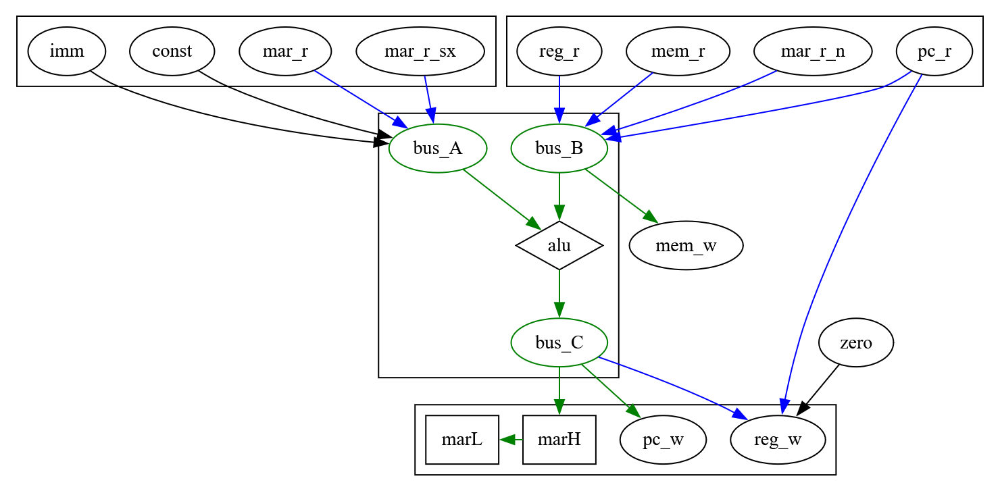

# Core structure, buses, control signals etc

This is a potential structure for the processor core.  It evolved over
a long period, originally being based on a different instruction set,
but with the transition to RISC-V it has changed again based on what
seemed to be required in microcode to implement each instruction.  It
is now somewhat out of date as I have pushed forwards more on the
software side and will need to make some changes to the microcode and
hence control signals to support that.

I am trying to keep the structure as simple as I can get away with,
while not requiring extensive amounts of microcode.  At present some
instructions complete in two cycles, most require 3 or 4, and some require
5, 6 or 7.  Branches based on two registers are especially expensive as it 
takes one cycle to fetch each byte of each register, but they can also 
early-out in some cases if the branch is not going to be taken.

The memory interface and internal bus structure is all 8-bit, but the
registers, program counter, and MAR are 16-bit.  To make this work,
each cycle is designated either a "low" cycle or a "high" cycle, and
corresponding halves of registers are read from or written to in each
cycle.  The 8-bit ALU has an internal carry flag which is used in 
operations such as "add" in the same manner as the 6502's, but it is
only used in microcode, not externally visible to the ISA.

The 16-bit Memory Address Register (MAR) provides the address output
for memory reads and writes.  Unlike normal registers it is loaded in
shift-register fashion, always low byte followed by high byte.  It is
also sometimes used as an intermediate during more complex operations,
especially bit-shifts, with options to feed its high byte back
into the A or B buses where necessary, while its low byte is an extra
input to the ALU used during shift operations.  Sometimes these operations
use the high byte's sign-extension (mar_r_sx) or whether it's negative 
(mar_r_n) - these operations are simple to perform in hardware.

Instruction fetch and the program counter are not really handled here, 
except that the core can read from and write back to the program counter.
RISC-V's behaviour around the program counter seems a bit awkward to 
support properly and may require having two program counters - one 
already-incremented and the other not - for use in different contexts.

## Block diagram

In the diagram below, elements in green are directly connected to each
other, while arrows in blue represent cases where the source of the
arrow can also be hi-Z.  Maybe some of the black arrows should be
blue.

[Diagram source](corediagram.dot)

There are three main 8-bit buses - Bus A, Bus B, and Bus C.

Bus A is the ALU's first input, and it is driven either by immediate
data from the instruction, or from a small set of constant values, or
from various views of the MAR register.

Bus B is driven by register or memory reads, or by the program counter
or MAR.  It forms the ALU's second input and is also used as the
source for memory-write operations.

Bus C is the ALU's output and can be used to set the MAR, the program
counter, or a register value.

Registers can also be set directly from the program counter, or with
the zero value, independently of the ALU which may be used for other
purposes in parallel.

